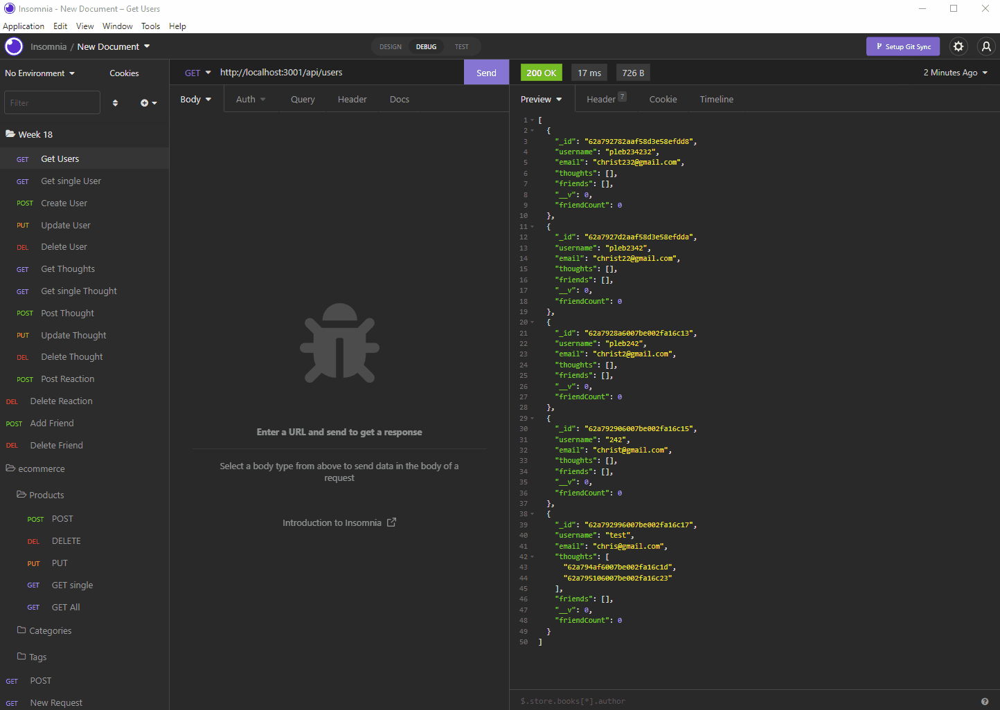
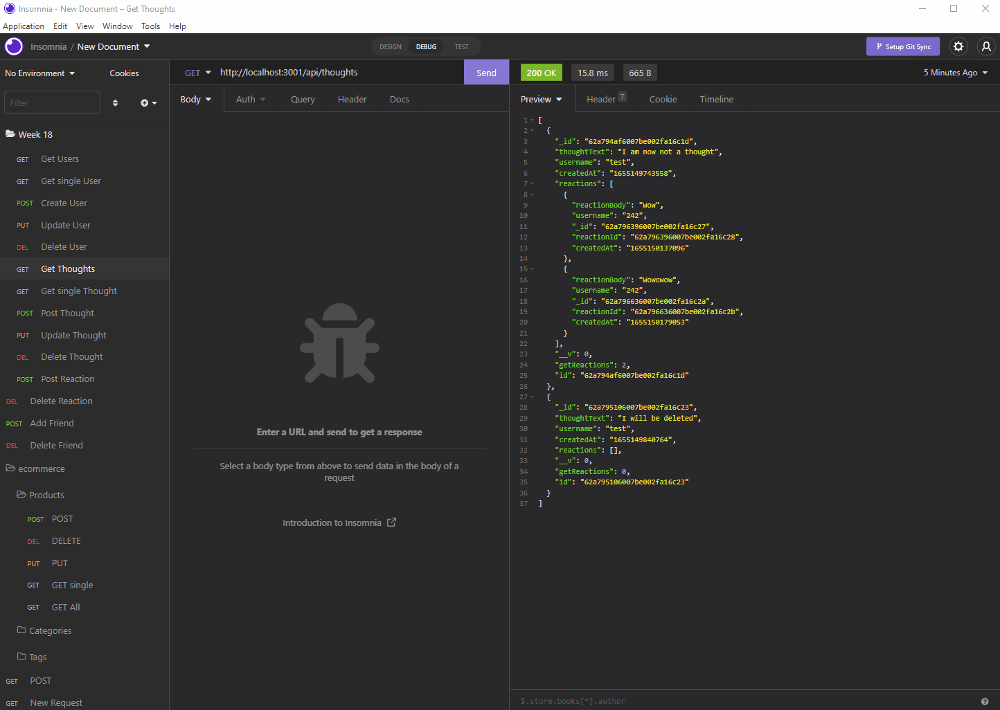
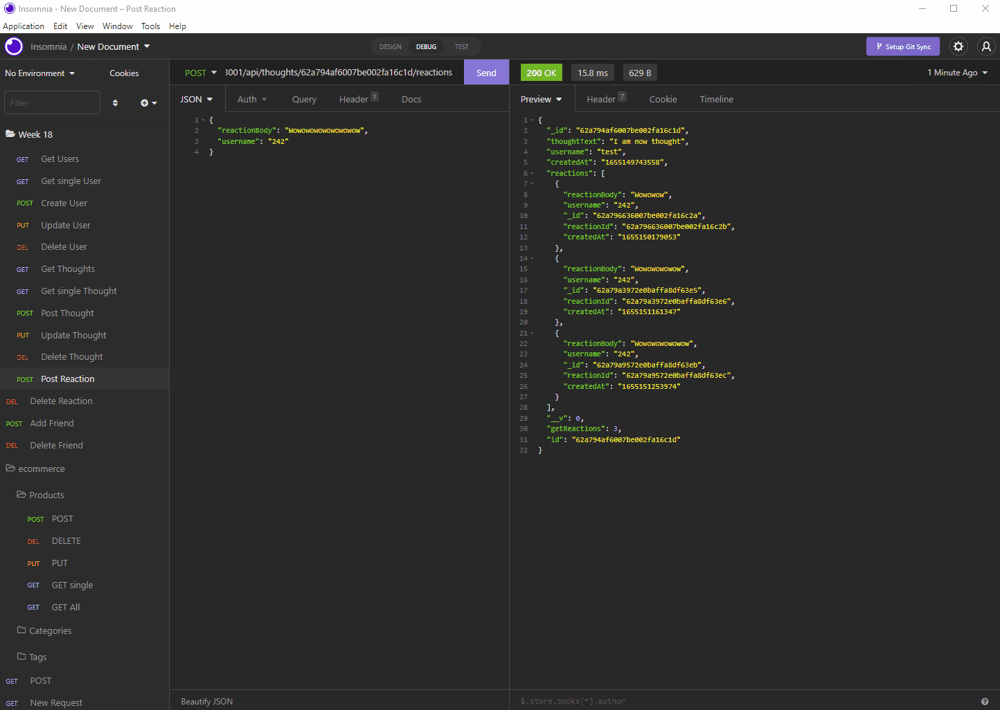

## snAPI


## License description: (https://opensource.org/licenses/MIT)

## Description:
snAPI is built to handle your social media backend needs! Using this simple layout of a social network API you can add and edit users, thoughts, reactions, and friends!


## Table of Contents
* [Description](#description)
* [Installtion](#installation)
* [Videos](#walkthrough-videos)
* [Questions](#questions)


## Installation: 
This application uses MongoDB. Once your computer has Mongo installed, clone this repository and run 
```bash
npm i
```
and
```bash
npm run watch
```

## Walkthrough Videos 

User Routes 


Thought Routes


Reaction and Friend Routes



## Questions:
If you have any questions please contact me at chris.tierney3@gmail.com or https://github.com/christierney3